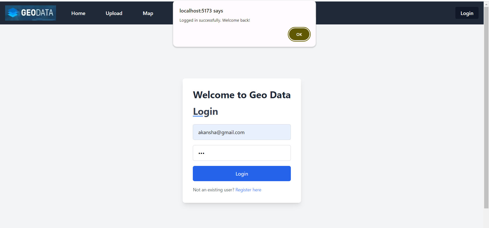

# Geo-Data App

This is a fullstack web application that allows users to manage and visualize geospatial data. Users can create an account, upload GeoJSON or KML files, render these files on a map using React Leaflet, and draw custom shapes on the map.

## Preview

## Table of Contents
1. [Technical Overview](#technical-overview)
2. [Getting Started](#getting-started)
3. [Backend](#backend)
4. [Frontend](#frontend)
5. [Deployment](#deployment)

## Technical Overview

- **Frontend**: Developed using React.
- **Backend**: Developed using the Go programming language.
- **Database**: PostgreSQL is used to store user data and geospatial information.
- **User Authentication**: Implemented using JWT (JSON Web Tokens).
- **APIs**: RESTful APIs are used for user authentication, account management, file upload, and shape management.
- **Map Rendering**: React Leaflet library is integrated to render maps and display uploaded GeoJSON/KML files.
- **Custom Shape Drawing**: Leaflet Draw plugin is used to allow users to draw custom shapes on the map.
- **Responsive Design**: Ensured responsiveness and user-friendly design using CSS frameworks like Bootstrap or Material-UI.

## Getting Started

To get started with the application, follow these steps:

1. Clone the repository: `git clone <repository-url>`
2. Navigate to the backend directory: `cd backend`
3. Set up the backend environment and database: 
    `go run main.go`
4. Navigate to the frontend directory: `cd frontend`
5. Install dependencies: `npm install`
6. Start the frontend server: `npm run dev`

## Backend

The backend of the application is developed using the Go programming language. It includes APIs for user authentication, account management, file upload, and shape management. PostgreSQL is used as the database to store user data and geospatial information. 

## Frontend

The frontend of the application is developed using React. It provides a user-friendly interface for uploading and managing GeoJSON/KML files, rendering maps, drawing custom shapes, and editing shapes. React Leaflet library is integrated to render maps and display uploaded files.

## Deployment

live link: https://geo-data-kappa.vercel.app/

